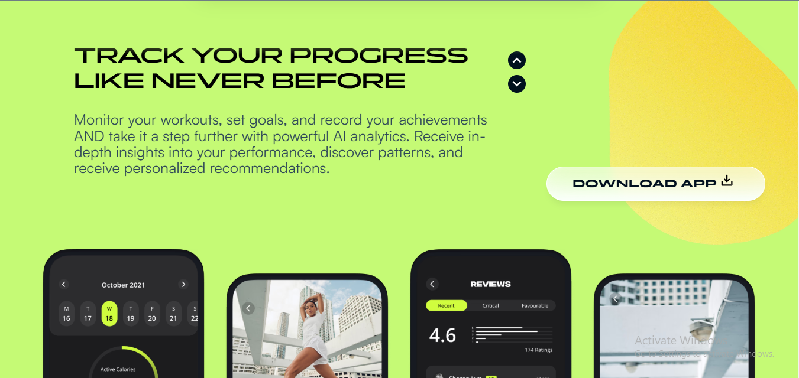

# Fully-Animated-React-Next.js-Framer-Gym-Website
This is a fully animated website built using React, Next.js, Framer Motion, and GSAP. The website includes smooth animations, responsive design, and an engaging user interface.

Features:
Animations: Implemented advanced animations using GSAP and Framer Motion.
Responsiveness: The website is fully responsive and works seamlessly on different devices.
Technologies Used: React.js, Next.js, Framer Motion, GSAP, and modern CSS.
Backstory:
I built this project for a client on Fiverr for just $5. Despite delivering all the agreed-upon features (and more!), the client requested additional features beyond the initial scope. Unfortunately, the deal didn’t reach completion.

Highlights:
Client Requirements Fulfilled: Delivered all requested features within the budget and timeline.
Extra Mile: Focused on providing a polished, professional user experience.
Learning Experience: An example of balancing client requests with professional boundaries.
Feel free to check out the code and explore the animations! Feedback is always welcome.

WEBSITE LINK:  https://gymwebsite-two-drab.vercel.app/

